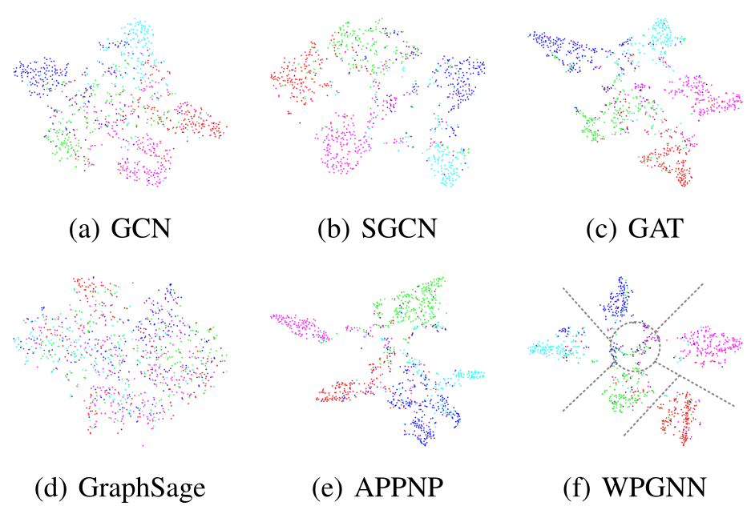

## WPGNN

### The code of the proposed method WPGNN
We open source core implementations for the proposed method, including graph fusion, weight-perceputal convolution, usage of the code and experiments.

#### Graph Fusion

The calculation of the graph fusion is under the ffusion floder. In  this code, ${\tilde{\mathbf{A}}}, \Delta, {\bf{A}}^{\rm{bias}}, {\bf{A}}^{\rm{fuzzy}}, {\bf{A}}^{\rm{enhance}}, {\bf{A}}^{\rm{diff}}$ are described as follows.

##### Usage of the code
```bash
python main.py
```

#### Weight-Perceputal Convolution

(1) Initialized weight block
```bash
interres = self.out_features // args.block_num
dim_main = [interres]*(args.block_num-1)
indexdim =  dim_main+ [self.out_features-sum(dim_main)]

self.weightf = torch.nn.ParameterList([Parameter(torch.FloatTensor(self.in_features, indexdim[i])) for i in range(args.block_num)])
for i in range(len(self.weightf)):
    self.weightf[i] = Parameter(self.weightf[i])
self.reset_parametersf()
```
(2) PerMM
Notes that the convolution of features and weights is different from matrix multiplication.
```bash
def featureswq(features, weights,queues):
    '''PerMM Modules
    '''
    def wpools(tfeatures):
        pools = []
        for i in range(args.enhance_range):
            for j in range(i+1,args.enhance_range):
                if i != j:
                    pools.append(tfeatures[i]*tfeatures[j])
        return pools

    if queues==1:
        features = features@weights

        #segmentation features
        nfeatures = []
        for tb in torch.split(features,1,dim=1):
            nfeatures.append(tb)

        #ehance features
        pfeatures = wpools(nfeatures)
        #RandomSampling()
        index = np.random.randint(0,len(pfeatures), args.extend_dim//args.block_num)
        for i in range(len(index)):
            nfeatures.append(pfeatures[index[i]])
            
    elif queues==2:
        features = features@weights
        nfeatures = features
        return nfeatures
    
    #concatenation
    return torch.cat(nfeatures,axis=-1)
```

#### Usage of the code
```bash
python -u main.py --dataset Cora --hidden_channels 90 --block_num 8 > ch90b8.txt --extend_dim 16
```
The experimental results:
```
Split: 01, Run: 01, Epoch: 200, Loss: 0.3514, Train: 99.29%, Valid: 80.80% Test: 83.50%
Split: 01, Run: 01, Epoch: 400, Loss: 0.3106, Train: 98.57%, Valid: 79.20% Test: 81.90%
have saved
Split: 01, Run: 01
None time:  89.00441912095994
None Run 01:
Highest Train: 100.00
Highest Valid: 82.20
  Final Train: 99.29
   Final Test: 84.20
Split: 01, Run: 02, Epoch: 200, Loss: 0.2972, Train: 99.29%, Valid: 80.80% Test: 82.40%
Split: 01, Run: 02, Epoch: 400, Loss: 0.2712, Train: 98.57%, Valid: 80.40% Test: 83.30%
have saved
Split: 01, Run: 02
None time:  89.77616736409254
None Run 02:
Highest Train: 100.00
Highest Valid: 82.20
  Final Train: 99.29
   Final Test: 84.10
Split: 01, Run: 03, Epoch: 200, Loss: 0.2957, Train: 99.29%, Valid: 80.20% Test: 83.80%
Split: 01, Run: 03, Epoch: 400, Loss: 0.2886, Train: 98.57%, Valid: 80.00% Test: 82.70%
have saved
Split: 01, Run: 03
None time:  90.24096305901185
None Run 03:
Highest Train: 100.00
Highest Valid: 82.00
  Final Train: 99.29
   Final Test: 84.50
Split: 01, Run: 04, Epoch: 200, Loss: 0.3029, Train: 99.29%, Valid: 80.20% Test: 83.70%
Split: 01, Run: 04, Epoch: 400, Loss: 0.3182, Train: 99.29%, Valid: 81.20% Test: 83.10%
have saved
Split: 01, Run: 04
None time:  90.71412326698191
None Run 04:
Highest Train: 100.00
Highest Valid: 82.00
  Final Train: 99.29
   Final Test: 84.00
Split: 01, Run: 05, Epoch: 200, Loss: 0.3088, Train: 99.29%, Valid: 81.40% Test: 83.70%
Split: 01, Run: 05, Epoch: 400, Loss: 0.2807, Train: 99.29%, Valid: 80.80% Test: 83.40%
have saved
Split: 01, Run: 05
None time:  90.16102359793149
None Run 05:
Highest Train: 100.00
Highest Valid: 82.00
  Final Train: 99.29
   Final Test: 84.70
total time:  451.7313406181056
None All runs:
Highest Train: 100.00 ± 0.00
Highest Valid: 82.08 ± 0.11
  Final Train: 99.29 ± 0.00
   Final Test: 84.30 ± 0.29
```

#### Experiments 
We visualize the node embeddings representation of the last hidden layer on the Citeseer datasets by our WPGNN and five state-of-the arts: GCN, SGCN, GAT, GraphSage and APPNP. It has been demonstrated that the WPGNN is effective. The more visualizations of learned embeddings are shown in the Appendix.

<center></center>

### The code of baselines
The code of the baseline algorithm  is as follows:


| Method | Code |
|--|--|
| APPNP | https://github.com/ChenaniahMe/codes/tree/main/GNN/comappnp/appnp |
| ElasticGNN | https://github.com/ChenaniahMe/codes/tree/main/GNN/comelasticgnn/ElasticGNNb |
| GAT | https://github.com/ChenaniahMe/codes/tree/main/GNN/comgat |
| GCN | https://github.com/ChenaniahMe/codes/tree/main/GNN/comgcn |
| GraphSage | https://github.com/ChenaniahMe/codes/tree/main/GNN/comgraphsage |
| SGCN | https://github.com/ChenaMe/codes/tree/main/GNN/comsgcn |


### Requirements
Our implementation works with
CUDA 9.0
torch=1.8.1
torch-geometric=2.0.2
torch-scatter=2.0.6
torch-sparse=0.6.10
numpy==1.19.5
